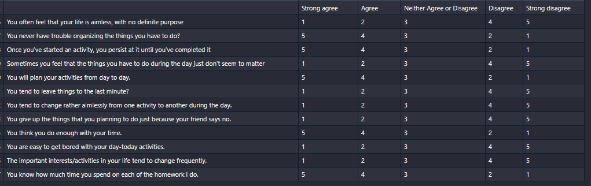
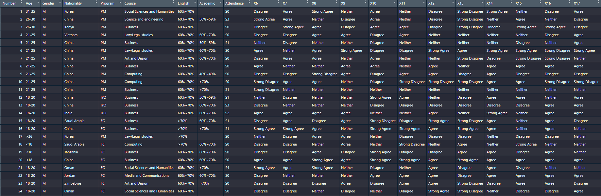

```{r setup, include=FALSE}
knitr::opts_chunk$set(echo = TRUE)
```

# Introduction :

L'objectif de ce tp est de déterminer les associations pertinentes entres les questions et les réponses dans un questionnaire qui aideront à
comprendre l'état des lieux et prendre des décisions. Et cela en appliquant l'AFCM à ce questionnaire.

L’AFCM est une méthode d’analyse de données qui consiste à appliquer l’AFC à l’étude des tableaux qui sont résultats d’observations d’individus
sur plus de deux variables qualitatives mises sous forme d’un tableau disjonctif complet.

Ce rapport est organisé comme suivant :

  - Introduction
  - Présentation du dataset
  - Prétraitement des données
  - Etude et visualisation des statistiques des données
  - Préparation à l'AFCm
  - AFCM sur le questionnaire
  - AFC sur deux questions
  

# Présentation du dataset : 

Les données ont été recueillies par un questionnaire. Il est basé sur des recherches en temps réel au Nottingham Trent International College. Il vise à aider les chercheurs à découvrir les facteurs qui affectent les compétences de gestion du temps des étudiants.

Le dataset comprend des informations sur les étudiants telles que l'âge, le sexe, les nationalités, les programmes d'études, les notes académiques, les notes des cours de langue et la fréquentation ,les réponses des étudiants aux 11 autres questions liées aux compétences en gestion du temps.




## Importation des données : 

Ici nous allons importer les données à partir du fichier csv, et découvrir le dataset : 
```{r}

# Importer les données
data <- read.csv("International students Time management data.csv")

# Nombre de variables
print(ncol(data))

# Nombre d'individus
print(nrow(data))

# Le noms des variables
for(i in 1:ncol(data)){
  print(colnames(data)[i])
}


```
Donc on a 21 variables et 125 individus dans le dataset



# Prétraitement des données : 

On fait un summary pour voir les types des variables : 

```{r}

summary(data)
```

La première variables Number est quantitative et elle représente uniquement un numéro séquentiel pour désigner un individu, donc on doit l'éliminer : 
```{r}
data$Number <- NULL
```

On a remarqué qu'il y a des valeurs manquantes dans nos données, on va les détécter pour décider comment on va remédier à ce problème.
D'abord on vérifie s'il y a des valeurs de types NA dans chaque colonnes

```{r}

for (i in 1: ncol(data)){
  print(sum(is.na(data[,i])))
}

```
On conclut qu'il n'y a pas de valeurs de type NA, donc on vérifie les chaine de characters vide : 
```{r}
for (i in 1: ncol(data)){
  print(c(colnames(data)[i],sum((data[,i] == ""))/nrow(data)*100))
}

```

On remarque que la variable académique a un nombre important de valeurs manquantes ( 17.6%) par rapport aux autres variables.
Nous allons opter à remplacer les valeurs manquantes dans chaque variables avec le mode de cette variable.Pour ce faire, on aura besoin d'une fonction qui retourne le mode d'une colonne :

```{r}
Mode <- function(u){
  tmp <- unique(u)
  tmp[which.max(tabulate(match(u,tmp)))]
}

# Le mode de la colonne académique
Mode(data$Academic)
```


Le remplissage des valeurs manquantes : 

```{r}
for (i in 1: ncol(data)){
  data[data[,i] == "",i] <- Mode(data[,i])
}

```

On a nettoyé nos données avec succés, il n'y a plus de valeurs manquantes :

```{r}

for (i in 1: ncol(data)){
  print(c(colnames(data)[i],sum((data[,i] == ""))/nrow(data)*100))
}
```

# Etude et visualisation des statistiques des données :


```{r,out.width="100%"}
Cat_plot <- function(y,title){
  n <- table(y)
  barplot(n[order(n, decreasing = TRUE)],las = 2,main=title,ylab = "Count")
  
}

Cat_plot(data$Nationality,"Frequence of each modality in : Nationality")

#The majority (77) of the students surveyed were Chinese 
#followed by Saudi Arabia, and Korea at 6
#The majority of the countries either had 2 or 1 student surveyed.

```


```{r}
for (i in 1:ncol(data))
  print(length(levels(data[,i])))
```


```{r}
# transform variables to factors
for(i in 1: ncol(data)){
  data[,i] <- as.factor(data[,i])
}

# make the complete disjunctive table
tdc <- tab.disjonctif(data)

df <- as.data.frame(tdc)

n <- nrow(df)
k <- 0

for( i in 1: ncol(df)){
  ns <- sum(df[,i])
  fs <- ns /ns
  
  if( fs > 0.5){
    #print(colnames(df)[i])
    k <- k + 1
  }

}

print(k)
```


```{r,out.width="100%"}
# apply mca to data
acm <- CA(df)
```

```{r,out.width="100%"}
# eigen values
head(acm$eig)
barplot(acm$eig[,1],acm$eig[,2])
```
```{r}
# absolute contribution
head(acm$col$contrib)

```

```{r}
# quality of representation of variables
head(acm$col$cos2)
```

```{r}
########################################### AFC

tc <- table(data$Academic,data$Attendance)
tc
```

```{r,out.width="100%"}
afc <- CA(tc)
```

```{r}
afc$eig
```

