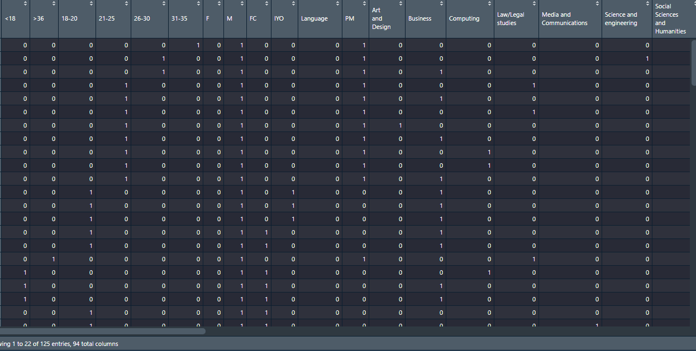

```{r setup, include=FALSE}
knitr::opts_chunk$set(echo = TRUE)
```

# Introduction :

L'objectif de ce tp est de déterminer les associations pertinentes entres les questions et les réponses dans un questionnaire qui aideront à
comprendre l'état des lieux et prendre des décisions. Et cela en appliquant l'AFCM à ce questionnaire.

L’AFCM est une méthode d’analyse de données qui consiste à appliquer l’AFC à l’étude des tableaux qui sont résultats d’observations d’individus
sur plus de deux variables qualitatives mises sous forme d’un tableau disjonctif complet.

Ce rapport est organisé comme suivant :

  - Introduction
  - Présentation du dataset
  - Prétraitement des données
  - Etude et visualisation des statistiques des données
  - Préparation à l'AFCm
  - AFCM sur le questionnaire
  - AFC sur deux questions
  - Conclusion 
  

# Présentation du dataset : 

Les données ont été recueillies par un questionnaire. Il est basé sur des recherches en temps réel au Nottingham Trent International College. Il vise à aider les chercheurs à découvrir les facteurs qui affectent les compétences de gestion du temps des étudiants.

Le dataset comprend des informations sur les étudiants telles que l'âge, le sexe, les nationalités, les programmes d'études, les notes académiques, les notes des cours de langue et la fréquentation ,les réponses des étudiants aux 11 autres questions liées aux compétences en gestion du temps.


## Importation des données : 

Ici nous allons importer les données à partir du fichier csv, et découvrir le dataset : 
```{r}

# Importer les données
data <- read.csv("International students Time management data.csv")

# Nombre de variables
print(ncol(data))

# Nombre d'individus
print(nrow(data))

# Le noms des variables
for(i in 1:ncol(data)){
  print(colnames(data)[i])
}


```
Donc on a 21 variables et 125 individus dans le dataset


# Prétraitement des données : 

On fait un summary pour voir les types des variables : 

```{r}

summary(data)
```

La première variables Number est quantitative et elle représente uniquement un numéro séquentiel pour désigner un individu, donc on doit l'éliminer : 
```{r}
data$Number <- NULL
```

On a remarqué qu'il y a des valeurs manquantes dans nos données, on va les détécter pour décider comment on va remédier à ce problème.
D'abord on vérifie s'il y a des valeurs de types NA dans chaque colonnes

```{r}

for (i in 1: ncol(data)){
  print(sum(is.na(data[,i])))
}

```
On conclut qu'il n'y a pas de valeurs de type NA, donc on vérifie les chaine de characters vide : 
```{r}
for (i in 1: ncol(data)){
  print(c(colnames(data)[i],sum((data[,i] == ""))/nrow(data)*100))
}

```

On remarque que la variable académique a un nombre important de valeurs manquantes ( 17.6%) par rapport aux autres variables.
Nous allons opter à remplacer les valeurs manquantes dans chaque variables avec le mode de cette variable.Pour ce faire, on aura besoin d'une fonction qui retourne le mode d'une colonne :

```{r}
Mode <- function(u){
  tmp <- unique(u)
  tmp[which.max(tabulate(match(u,tmp)))]
}

# Le mode de la colonne académique
Mode(data$Academic)
```


Le remplissage des valeurs manquantes : 

```{r}
for (i in 1: ncol(data)){
  data[data[,i] == "",i] <- Mode(data[,i])
}

```

On a nettoyé nos données avec succés, il n'y a plus de valeurs manquantes :

```{r}

for (i in 1: ncol(data)){
  print(c(colnames(data)[i],sum((data[,i] == ""))/nrow(data)*100))
}
```

# Etude et visualisation des statistiques des données :

Dans cette section , nous allons commencer à explorer nos données en étudiant les modalités de chaque variables.
On aura besoin d'une fonction qui va nous donner des graphes consisten pour chaque variables

```{r,out.width="100%"}
Cat_plot <- function(y,title){
  n <- table(y)
  barplot(n,las = 2,main=title,ylab = "Count")
  text(x =n, label = n,pos = 1, col = "red")
  
}

```

## La variable Age : 
En regardant le graph ci-dessous, il est clair que la majorité des personnes interrogées appartenaient au groupe d'âge 21-25 ans. Il y avait 6 personnes de moins de 18 ans et 4 de plus de 36 ans.

```{r}
Cat_plot(data$Age,"La répartiton de l'age dans cette étude")

```

## La variable Gender : 

Il y avait une répartition presque égale entre les deux sexes dans l'enquête, 63 femmes et 62 hommes.

```{r}
Cat_plot(data$Gender,"La répartiton du sexe dans cette étude")
```

## La variable Nationality 

La majorité (77) des étudiants interrogés étaient chinois, suivis par l'Arabie saoudite et la Corée à 6. La majorité des pays avaient 2 ou 1 étudiant interrogé.

```{r}
Cat_plot(data$Nationality,"La répartiton de la nationalité dans cette étude")

```

## La variable Program : 

La majorité des répondants au sondage étaient dans le programme PM, suivi du programme FC à 31 étudiants. Le programme de langue n'avait qu'un seul étudiant interrogé.

```{r}
Cat_plot(data$Program,"La répartiton du Program dans cette étude")
```

## La variable Course : 

La plupart des étudiants interrogés suivaient le cours du Business  (80), suivis de ceux du cours de Law/Legal Studies (14). Le cours sur Media and Communications a le plus petit nombre d'étudiants interrogés à 3.

```{r}
Cat_plot(data$Course,"La répartiton des Cours dans cette étude")
```

## La variable English 

Seuls 15 étudiants interrogés avaient des notes supérieures à 70%, la majorité des étudiants se situant entre 60 et 70%. Il y avait  une seule personne qui était inférieure à 40 %.

```{r}
Cat_plot(data$English,"La répartiton du English  dans cette étude")
```

## La variable Academic : 

Les notes des cours académiques suivent un modèle similaire à ce que nous avons vu avec les notes des cours d'anglais, la majorité des étudiants interrogés se situent entre 60 et 70%, 13 se situant entre 70% et plus et2 avaient des notes inférieures à 40%.

```{r}
Cat_plot(data$Academic,"La répartiton du Academic dans cette étude")
```

## La variable Attendance :

La majorité des étudiants interrogés appartenaient au groupe S0 (63), cela signifie que la plupart des étudiants avaient le plus de présence.

```{r}
Cat_plot(data$Attendance,"La répartiton de l'Attendance dans cette étude")
```

## La variable question 6 : 

50 étudiants interrogés sont en désaccord avec l'affirmation selon laquelle leur vie est sans but, sans but précis, c'est la majorité. 23 étudiants interrogés étaient d'accord avec la déclaration, tandis que 27 étudiants n'avaient aucun sentiment dans les deux sens.

```{r}
Cat_plot(data$X6,"La répartiton des réponse sur la question 6 dans cette étude")
```

## La variable question 7 :

40 étudiants interrogés ont déclaré qu'ils avaient du mal à organiser les choses qu'ils ont à faire et 35 ont dit qu'ils n'avaient pas de mal. Un total de 14 étudiants ont des sentiments forts dans les deux sens et c'est une répartition égale dans les deux sens.

```{r}
Cat_plot(data$X7,"La répartiton des réponse sur la question 7 dans cette étude")
```

## La variable question 8 : 


61 étudiants interrogés ont déclaré qu'une fois qu'ils ont commencé quelque chose, ils le finiront. Au total, 28 élèves ont déclaré qu'ils étaient soit en désaccord soit fortement en désaccord quant à la fin des activités qu'ils ont commencées.

```{r}
Cat_plot(data$X8,"La répartiton des réponse sur la question 8 dans cette étude")
```

## La variable question 9 : 

44 étudiants interrogés étaient d'accord ou fortement d'accord qu'ils ont parfois l'impression que les choses qu'ils doivent faire pendant la journée n'ont tout simplement pas d'importance et 26 étudiants étaient en désaccord ou fortement en désaccord. La majorité des étudiants (48) n'ont répondu ni l'un ni l'autre.

```{r}
Cat_plot(data$X9,"La répartiton des réponse sur la question 9 dans cette étude")
```

## La variable question 10 : 

Au total, 57 élèves ont déclaré être fortement d'accord ou d'accord avec l'énoncé selon lequel ils planifient leurs activités. 34 élèves n'ont répondu ni l'un ni l'autre.

```{r}
Cat_plot(data$X10,"La répartiton des réponse sur la question 10 dans cette étude")
```

## La variable question 11 :

La plupart des étudiants (38) ont déclaré qu'ils n'étaient pas d'accord avec l'affirmation selon laquelle ils avaient laissé les choses à la dernière minute. 31 ont dit qu'ils étaient d'accord pour laisser les choses à la dernière minute.

```{r}
Cat_plot(data$X11,"La répartiton des réponse sur la question 11 dans cette étude")
```

## La variable question 12 : 

52 étudiants ont déclaré qu'ils n'avaient pas tendance à passer sans but précis d'une activité à l'autre au cours de la journée, c'est le nombre le plus élevé parmi tous les choix possibles. Plus d'élèves étaient d'accord/tout à fait d'accord qu'en désaccord/pas du tout d'accord avec l'énoncé selon lequel ils ont tendance à passer sans but précis d'une activité à l'autre au cours de la journée.

```{r}
Cat_plot(data$X12,"La répartiton des réponse sur la question 12 dans cette étude")
```

## La variable question 13 : 

Plus d'étudiants (42 + 39 = 81) ont dit qu'ils étaient en désaccord/pas du tout d'accord que d'accord/tout à fait d'accord (13 + 5 = 18) lorsqu'il s'agissait d'abandonner les choses qu'ils avaient prévu de faire simplement parce que leur ami avait dit non.

```{r}
Cat_plot(data$X13,"La répartiton des réponse sur la question 13 dans cette étude")
```

## La variable question 14 : 

47 étudiants étaient d'accord/tout à fait d'accord qu'ils avaient fait assez de leur temps, et c'était la majorité des étudiants interrogés. 41 étudiants ont fait le chemin inverse avec leurs réponses et 37 n'ont dit ni l'un ni l'autre.

```{r}
Cat_plot(data$X14,"La répartiton des réponse sur la question 14 dans cette étude")
```

## La variable question 15 : 

La réponse la plus élevée à la question si les étudiants s'ennuient facilement avec leurs activités quotidiennes d'aujourd'hui était la réponse Neither avec 39 étudiants et est suivie par ceux qui étaient d'accord (36) qu'ils s'ennuient facilement avec leurs activités quotidiennes.

```{r}
Cat_plot(data$X15,"La répartiton des réponse sur la question 15 dans cette étude")
```

## La variable question 16 :

47 étudiants ont déclaré que leurs intérêts/activités importants dans leur vie avaient tendance à changer fréquemment. Cette réponse comptait le plus grand nombre d'étudiants et était suivie par ceux qui n'étaient pas d'accord (31).

```{r}
Cat_plot(data$X16,"La répartiton des réponse sur la question 16 dans cette étude")
```

## La variable question 17 : 

Plus d'élèves étaient d'accord (45) que pas d'accord (29) avec l'énoncé selon lequel ils savent combien de temps ils consacrent aux devoirs qu'ils font.

```{r}
Cat_plot(data$X17,"La répartiton des réponse sur la question 17 dans cette étude")
```

# Préparation à l'AFCm

Pour faire l'AFCM ou l'AFC il faut charger le package FactoMineR : 

```{r,warning=FALSE}
library(FactoMineR)
```


On a remarqué que la variable nationality possède un nombre de modalité important par rapport aux autres variables, donc on va l'éliminer, Aussi quelques variables ont le meme nom des modalités donc nous allons les renommer .
Et pour pouvoir transformer notre dataset à un tableau disjonctif complet, il faut d'abord transformer les colonnes au type factor :

```{r}

data$Nationality <- NULL

data$English <- paste("English",data$English,sep ="_")
data$Academic <- paste("Academic",data$Academic,sep ="_")
data$X6 <- paste("X6",data$X6,sep = "_")
data$X7 <- paste("X7",data$X7,sep ="_")
data$X8 <- paste("X8",data$X8,sep ="_")
data$X9 <- paste("X9",data$X9,sep ="_")
data$X10 <- paste("X10",data$X10,sep ="_")
data$X11 <- paste("X11",data$X11,sep ="_")
data$X12 <- paste("X12",data$X12,sep ="_")
data$X13 <- paste("X13",data$X13,sep ="_")
data$X14 <- paste("X14",data$X14,sep ="_")
data$X15 <- paste("X15",data$X15,sep ="_")
data$X16 <- paste("X16",data$X16,sep ="_")
data$X17 <- paste("X17",data$X17,sep ="_")

J <- 0

for(i in 1: ncol(data)){
  data[,i] <- as.factor(data[,i])
  J <- J + length(levels(data[,i]))
}

print(c("Nombre total de modaliés : " ,J))

```

```{r}

tdc <- tab.disjonctif(data)
df <- as.data.frame(tdc)
```



On a 125 individus, ici nous allons considérer que les modalités avec un effectif moins de 5 sont trés faible, donc on va éliminer ces modalités, nous avons opter pour cette option pour alléger un peu le nombre de colonne [ on avait 120 modalités] 

```{r}

n <- nrow(df)

i <- 1

while( i <= ncol(df) ){

  ns <- sum(df[,i])


  if( ns < 5  ){
    df[,i] <- NULL
    i <- 1
  }

  i <- i + 1
}

print(ncol(df))

```

# AFCM sur le questionnaire : 

Maintenant on a que 50 modalités , on va effectuer une AFC sur le tableau disjonctif complet : 

```{r}
acm <- CA(df,graph = F)
```

## valeurs propres :

```{r,out.width="100%"}

barplot(acm$eig[,1],acm$eig[,2])
```
On remarque que pour avoir un pourcentage d'interie d'au moins 80% il faut prendre les 31 premiers axes factoriels :

```{r}
acm$eig[,3]
```

## le biplot individus-variables :

```{r,out.width="100%"}
plot.CA(acm)
```

## Etude du tableau des contributions: 

Une variable contribue bien à la construction du premier axe si sa contribution absolue est supérieue à son poids : 


```{r}
contribCol <- as.data.frame(acm$col$contrib)
coordCol <- as.data.frame(acm$col$coord)

contribRow <- as.data.frame(acm$row$contrib)
coordRow <- as.data.frame(acm$row$coord)

print("######### Les variables qui contribuent le plus à la construction du premier axe ######### ")

for(i in 1:ncol(df)){
  
      ns <- sum(df[,i])
      fs <- ns /n
      
      if(contribCol$`Dim 1`[i] >= fs*100 && coordCol$`Dim 1`[i] > 0){
        print(c(colnames(df)[i],"+"))
      }
      if(contribCol$`Dim 1`[i] >= fs*100 && coordCol$`Dim 1`[i] < 0){
        print(c(colnames(df)[i],"-"))
      }
}

print("######### Les individus qui contribuent le plus à la construction du premier axe ######### ")

      
for(i in 1:nrow(df)){

      
      if(contribRow$`Dim 1`[i] > 100/n && coordRow$`Dim 1`[i] > 0){
        print(c(i,"+"))
      }
      if(contribRow$`Dim 1`[i] > 100/n && coordRow$`Dim 1`[i] < 0){
        print(c(i,"-"))
      }
}


```
On déduit que le premier axe est à effet taille, il caractèrise les individus qui ont répondu à la question 6 avec " tout à fait d'accord ", représenté par les individus 16,20,25,27,28,43,54,77,79,82,86,87,90,112,113,122 contrairement aux individus 4,7,38,46,58,61,62,64,66,91,96,98,100,105,106,107,111,114,117,119 qui ont été en désaccord avec la question 6

```{r}


print("######### Les variables qui contribuent le plus à la construction du 2ème axe ######### ")

for(i in 1:ncol(df)){
  
      ns <- sum(df[,i])
      fs <- ns /n
      
      if(contribCol$`Dim 2`[i] > fs*100 && coordCol$`Dim 2`[i] > 0){
        print(c(colnames(df)[i],"+"))
      }
      if(contribCol$`Dim 2`[i] > fs*100 && coordCol$`Dim 2`[i] < 0){
        print(c(colnames(df)[i],"-"))
      }
      
}

print("######### Les individus qui contribuent le plus à la construction du 2ème axe ######### ")

      
for(i in 1:nrow(df)){
  
      
      if(contribRow$`Dim 2`[i] > 100/n && coordRow$`Dim 2`[i] > 0){
        print(c(i,"+"))
      }
      if(contribRow$`Dim 2`[i] > 100/n && coordRow$`Dim 2`[i] < 0){
        print(c(i,"-"))
      }
}

```
On déduit que le 2ème axe est à effet taille, il caractèrise les étudiants qui ont déclaré que leurs age est compris entre 31 ans et 35 représenté par les individus 1,3,6,16,20,28,31,36,43,59,69,98,101,112,118,122,125 contrairement aux individus 5,11,26,27,30,49,73,76,80,82,88,89,113,120

On remarque que certaines individus n'ont pas un age entre 31 et 35 mais ils representent cet axe, on conclut donc que ces individus sont mal représentés.
Or on remarque aussi que ce premier plan factoriel ne représente que 11.16% de l'information contenue dans notre jeu de données.

## Les questions les mieux représentées par l'AFCM :

```{r}
cosCol <- as.data.frame(acm$col$cos2)

print("######### Les variables les mieux représentées par le  premier axe ######### ")

for(i in 1:ncol(df)){
  
      
      if(cosCol$`Dim 1`[i] >= 0.2 ){
        print(colnames(df)[i])
      }
}

print("######### Les variables les mieux représentées par le 2ème axe ######### ")

for(i in 1:ncol(df)){
  
      
      if(cosCol$`Dim 2`[i] >= 0.2 ){
        print(colnames(df)[i])
      }
}

```
# AFC sur deux questions : 
## Croiser 2 questions : 

on croise la variable académique [ les notes obtenues dans le cours acadèmique] à la variable attendance [ nombre d'absence :  s0 = faible, s4 elevé]

```{r}
tc <- table(data$Academic,data$Attendance)
tc
```

```{r,out.width="100%"}
afc <- CA(tc)
```

## valeurs propres :

On remarque qu'avec seulement les 2 premiers axe on a une tres bonne représentation

```{r,out.width="100%"}

barplot(afc$eig[,1],afc$eig[,2])
```


## Etude du tableau des contributions: 

```{r}
contribCol <- as.data.frame(afc$col$contrib)
coordCol <- as.data.frame(afc$col$coord)

contribRow <- as.data.frame(afc$row$contrib)
coordRow <- as.data.frame(afc$row$coord)

print("######### Les profile colonnes qui contribuent le plus à la construction du premier axe ######### ")

for(i in 1:ncol(tc)){
  
      ns <- sum(tc[,i])
      fs <- ns /n
      
      if(contribCol$`Dim 1`[i] >= fs*100 && coordCol$`Dim 1`[i] > 0){
        print(c(colnames(tc)[i],"+"))
      }
      if(contribCol$`Dim 1`[i] >= fs*100 && coordCol$`Dim 1`[i] < 0){
        print(c(colnames(tc)[i],"-"))
      }
}

print("######### Les profiles lignes qui contribuent le plus à la construction du premier axe ######### ")

      
for(i in 1:nrow(tc)){
  
      ns <- sum(tc[i,])
      fs <- ns /n

      if(contribRow$`Dim 1`[i] > fs*100 && coordRow$`Dim 1`[i] > 0){
        print(c(rownames(tc)[i],"+"))
      }
      if(contribRow$`Dim 1`[i] > fs*100 && coordRow$`Dim 1`[i] < 0){
        print(c(rownames(tc)[i],"-"))
      }
}

```

On déduit que le premier axe est à effet taille, il quantifie les classes qui ont beaucoup d'absences [s3] représenté par les individus qui ont des moyennes comprises entre 49% et 40% dans les cours académique et aussi les classes qui ont énormément d'absences [s4] représenté par les individus qui ont des moyennes inférieure à  40%.


```{r}

print("######### Les profile colonnes qui contribuent le plus à la construction du 2ème axe ######### ")

for(i in 1:ncol(tc)){
  
      ns <- sum(tc[,i])
      fs <- ns /n
      
      if(contribCol$`Dim 2`[i] >= fs*100 && coordCol$`Dim 2`[i] > 0){
        print(c(colnames(tc)[i],"+"))
      }
      if(contribCol$`Dim 2`[i] >= fs*100 && coordCol$`Dim 2`[i] < 0){
        print(c(colnames(tc)[i],"-"))
      }
}

print("######### Les profiles lignes qui contribuent le plus à la construction du 2ème axe ######### ")

      
for(i in 1:nrow(tc)){
  
      ns <- sum(tc[i,])
      fs <- ns /n

      if(contribRow$`Dim 2`[i] > fs*100 && coordRow$`Dim 2`[i] > 0){
        print(c(rownames(tc)[i],"+"))
      }
      if(contribRow$`Dim 2`[i] > fs*100 && coordRow$`Dim 2`[i] < 0){
        print(c(rownames(tc)[i],"-"))
      }
}


```

Aussi le 2ème axe est à effet taille, il quantifie les classes qui ont beaucoup beacoup d'absences [s4] représenté par les individus qui ont des moyenne inferieure à 40% dans les cours académique. 


# Conclusion : 

 - AFCM : 
 - AFC : Les étudiant qui s'absentent beaucoup ont tendance à avoir des moyennes faibles inférieure à  40%
 
 
 